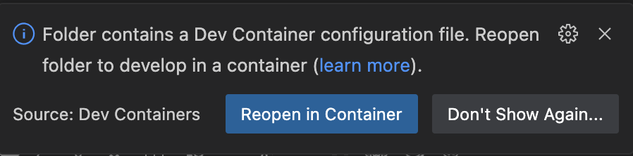
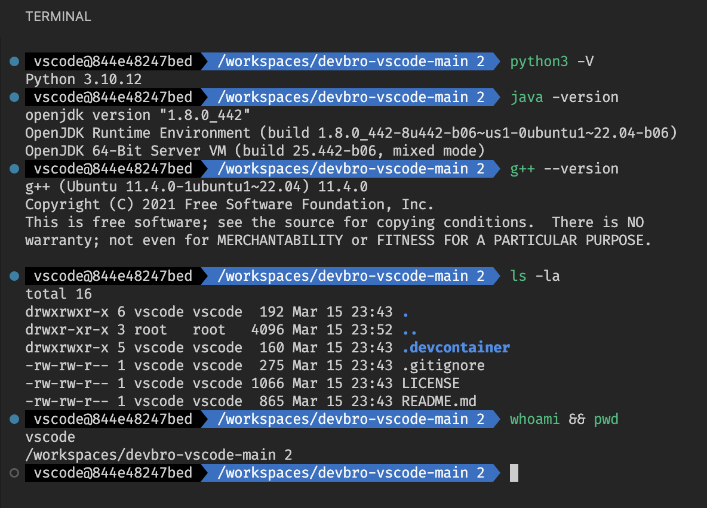
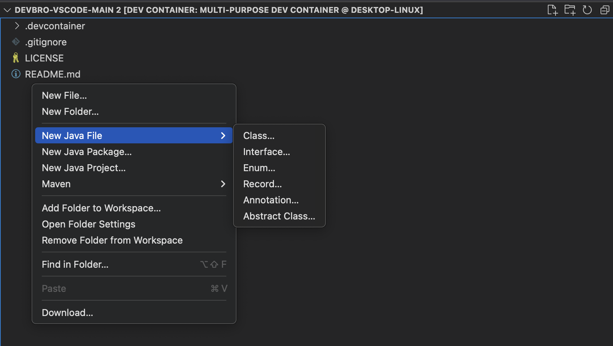

# Multi-Purpose Dev Container
This repository contains a multi-purpose development container configuration for Visual Studio Code. It provides a consistent, isolated environment for coding, installing libraries, and even hosting web applications—all without affecting your host system.

## Features

- **Pre-configured Environment:** Based on Ubuntu LTS with essential development tools.
- **Multiple Languages:** Comes with Python and Java 8 and C++ pre-installed. Easily extendable to include other languages.
- **Java 8:** Installed via openjdk-r PPA.
- **C++ Development:** Essential build tools (gcc, g++,gdb) are pre-installed.
- **Python:** Python 3 and pip are ready for use.
- **VS Code Integration:** Seamless integration with VS Code Remote Containers.
- **Customizable:** Modify the Dockerfile and `devcontainer.json` to add your preferred tools, libraries, and extensions.
- **zsh with oh‑my‑zsh:** Enjoy a visually appealing shell with autosuggestions and syntax highlighting.
- **Lightweight & Secure:** Uses best practices with minimal packages, noninteractive installs, and proper cache clean-up. *Note: Custom modifications are used at your own risk.*


## Prerequisites
Before you begin, ensure that you have the following installed:

- [Visual Studio Code](https://code.visualstudio.com/)
- [Docker](https://www.docker.com/get-started)
- VS Code Extension: **Dev Container**  
  (Install it from the Extensions view in VS Code: `Ctrl+Shift+X` or `Cmd+Shift+X`)

## Getting Started

1. **Clone the Repository:**

   ```bash
   git clone https://github.com/StheaRath/devbro-vscode.git
   code devbro-vscode
   
2. **Click Reopen Container:**


3. **Enjoy the Dev Container!**


### Help me out—Buy me a coffee and make my code (and maybe my tears) flow!

[](https://buymeacoffee.com/strath)

